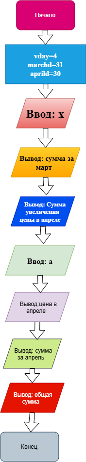

# Домашнее задание к работе 2

## Условие задачи  
В течении месяца продавец доставлял на дом 4 литра молока в день. В марте молоко стоило х рублей за литр. С первого апреля цена увеличилась на а рублей за литр.  
Сколько надо за-платить продавцу за все доставленное молоко в конце апреля?Количество покупаемого молока осталось прежним.

## 1. Алгоритм и блок-схема

### Алгоритм
1. **Начало**
2. Объявить константы:
   - `vday` = 4 (л/день) — ежедневный объем покупки.
   - `marchd` = 31 — количество дней в марте.
   - `aprild` = 30 — количество дней в апреле.
3. Задать исходные данные:
   - `x` — цена 1 литра молока в марте (руб.).
   - `a` — величина, на которую базовая цена увеличивается в апреле (руб.).
4. Вычислить и вывести стоимость молока в марте:  
   - `printf("Сумма за молоко в марте - %d руб \n", x * marchd)`
5. Вычислить и вывести новую цену молока в апреле:  
   - `printf("Цена за молоко в апреле: %d руб\n", x + a)`
6. Вычислить и вывести стоимость молока в апреле:  
   - `printf("Сумма за молоко в апреле - %d руб\n", (x+a) * aprild)`
7. Вычислить и вывести общую сумму к оплате:   
   - `printf("Общая сумма за молоко за март и апрель: %d руб", (x * marchd) + ((x + a) * aprild))`
8. **Конец**

### Блок-схема
   

## 2. Реализация программы
```C++

#include <stdio.h>
#include <locale.h>
int main()
{
	setlocale(LC_CTYPE, "RUS");
	int vday;
	int marchd;
	int aprild;
	int x;
	int a;
	vday = 4;
	marchd = 31;
	aprild = 30;
	puts("Цена за литр в марте: ");
	scanf("%d", &x);
	printf("Сумма за молоко в марте - %d руб \n", x * marchd);
	puts("Сумма на которую увеличилась цена в апреле:");
	scanf("%d", &a);
	printf("Цена за молоко в апреле: %d руб\n", x + a);
	printf("Сумма за молоко в апреле - %d руб\n", (x+a) * aprild);
	printf("Общая сумма за молоко за март и апрель: %d руб", (x * marchd) + ((x + a) * aprild));

}
```
## 3. Результаты работы программы

>Цена за литр в марте:  
>3  
>Сумма за молоко в марте - 93 руб  
>Сумма на которую увеличилась цена в апреле:  
>3  
>Цена за молоко в апреле: 6 руб  
>Сумма за молоко в апреле - 180 руб  
>Общая сумма за молоко за март и апрель: 273 руб  

## 4. Информация о разработчике
### Чудакова Екатерина бИЦТ-261
